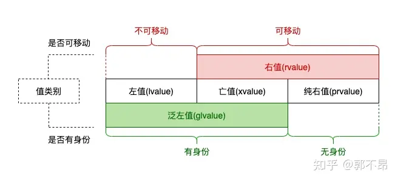
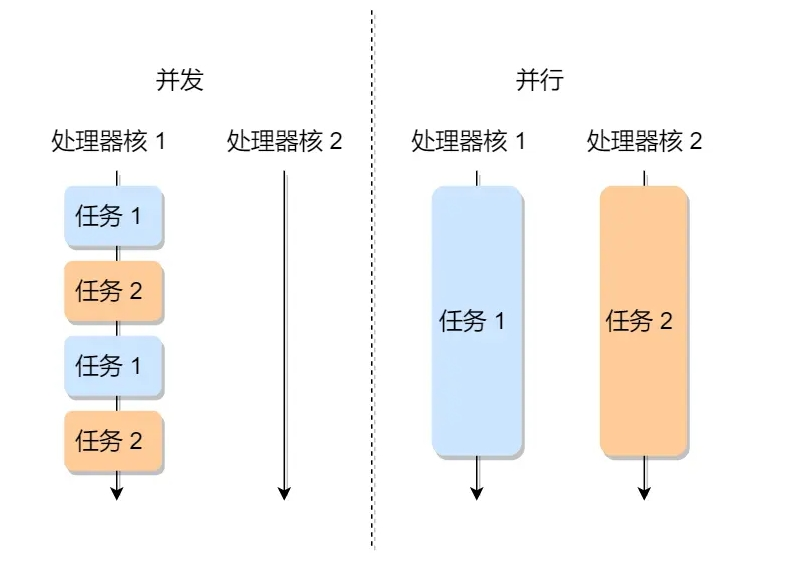

## TODO List

位运算

二叉树的操作

git

new delete 与 c中的 malloc

友元

大端小端

## 八股文

### 1.语言基础

#### 指针与引用

引用和指针都是复合类型，实现对其他对象的间接访问

引用相当于是一个别名，必须初始化：在定义引用的时候，程序会把引用和它的初始值绑定在一起

这节省了拷贝，但同时也代表了无法令引用绑定到另一个对象

指针则是一种指向，存放对象的地址

主要区别：

1. 指针本身是对象，而引用不是对象
   因此——
   (a)不能定义引用的引用，而指针则有指针的指针这样的类型
   (b)不能定义指向引用的指针，但相反存在对指针的引用
```c++
  int *p;
  int *&r = p;  // r是一个对指针p的引用
```
   (c)有常量指针而没有常量引用。常量指针不变的是指针本身，指向不变，顶层const。
      引用就没有顶层const,只有底层const，指向常量的引用。
  
2. 指针不必须在定义时赋初值

指针和引用占用的空间大小：

指针的占用大小与操作系统相关，32位机器占用4字节，64位机器占用8字节；指针类型则决定解引用时能访问的空间大小，以及指针的步长

#### 数组与指针

数组的大小是固定不变的，在连续的内存中存放了这组元素

可以通过指针来操作数组

很多时候用到数组名a的时候编译器会将其替换为指向数组首元素的指针&a[0], 数组名就视作首元素的地址

例外: 
    1.sizeof(数组名)得到整个数组的大小
    2.&a 取到的是整个数组的地址

#### 野指针

野指针: 指向非法的内存地址

情形:
1.使用未初始化的指针

2.指针所指对象已经消亡 (比如指针指向了一个局部变量，该局部变量在调用完后被回收了; 指针所指对象被别的指针回收掉了)

3.指针释放之后没有置空

避免方案:

1.指针在使用时一定要初始化或直接置空，或者不用指针，改用引用

2.free或delete后要置空


#### 左值与右值

C++中将表达式分为左值和右值。一个左值表达式表示对象的身份(在内存中的位置)，一个右值表达式表示对象的值(内容)

左值表达式是不可移动的，而右值表达式是可以移动的

左值: 
变量、函数、模板形参对象或数据成员的名字(std::cin);
返回类型为左值引用的函数调用;
++a/--a;
*ptr、取下标;

右值: 
取地址表达式 &a ;
this指针;
lambda表达式;
字面量;
各种数值运算表达式;
a++/a--;

<div align=center>

</div>

prvalue没有内存实体，取不到地址

xvalue 和 lvalue都有内存实体，但是生命周期不同。左值持久，右值短暂

#### 左值引用和右值引用

为了实现移动语义而引入了右值引用。

顾名思义，左值引用是绑定到左值的引用，右值引用是绑定到右值的引用。

左值引用无法绑定到一个右值上，不过const的引用可以

右值引用只能绑定到右值上，不过右值引用的表达式既可以是右值，也可以是左值

```c++
void foo(int &)  { std::cout << "lvalue" << std::endl; }
void foo(int &&) { std::cout << "rvalue" << std::endl; }

int main() {
  int &&rref = 1;
  foo(rref);    // output: lvalue
}

// https://www.zhihu.com/question/363686723/answer/1976488046
```

此外还可以使用转发引用实现std::forward()

```c++
#include <iostream>
#include <string>

using namespace std;

void PrintV(int &t) {
  cout << "lvalue" << endl;
}

void PrintV(int &&t) {
  cout << "rvalue" << endl;
}

template<typename T>
void Test(T &&t) {
  PrintV(t);
  PrintV(std::forward<T>(t));

  PrintV(std::move(t));
}

int main() {
  Test(1); // lvalue rvalue rvalue
  int a = 1;
  Test(a); // lvalue lvalue rvalue
  Test(std::forward<int>(a)); // lvalue rvalue rvalue
  Test(std::forward<int&>(a)); // lvalue lvalue rvalue
  Test(std::forward<int&&>(a)); // lvalue rvalue rvalue
  return 0;
}
```

#### new 与 malloc

最大区别：new在申请空间时会调用构造函数，而malloc不会

申请失败：new返回bad_alloc错误码, malloc返回NULL

属性上：new是关键字，需要编译器支持; malloc是库函数，需要头文件支持

参数上: new返回对象类型指针，不用指定内存大小，会调用该类的构造函数; malloc需要显式指定内存大小，并且没有初始化，值随机。返回void*, 需要强制转换为你需要的指针类型。

内存泄露: 均能检测，new能指出那个文件哪一行泄露，malloc不能

内存位置: new在自由存储区(c++独有)分配, 多数编译器默认用堆实现自由存储, 当然可以重载来自己决定分配位置; malloc在堆中分配

扩张内存: new不能; malloc时，想扩张可以调用realloc函数申请内存扩张

自定义类型: new先调用operator new申请内存，后调用构造函数。可以重载

有时不需要两个功能组合的new, new一大块数组但用不完, 或者没有默认构造函数的类会没法动态分配数组，需要分离new的内存分配功能和构造功能。c++中可以用allocator类实现内存分配

#### const关键字 static关键字

#### 函数重载 函数匹配

#### 内存泄漏

常见的内存泄漏

怎么避免内存泄漏

怎么排查内存泄漏

#### struct 与 class

他们只有两个区别：

1 默认的访问权限不同。struct默认都是public成员，class默认是private成员

2 默认的继承派生访问符不同。struct默认public继承，class默认private继承

```c++
class Base {};
struct D1 : Base {};  // 默认public继承
class D2 : Base {};   // 默认private继承
```

#### OOP:多态和继承

继承，通过已有类定义新类，实现软件复用

polymorphism多态，可以使得在执行同一条语句时，能够根据运行情况执行不同的操作，易于系统的扩展

多态性的实现：引用或指针的静态类型和动态类型不同，通过动态绑定，在运行时解析该调用，实现多态；
因此，只有使用基类的引用或指针调用一个虚函数时才会发生动态绑定

虚函数(virtual function) 允许了派生类定义其各自版本的该函数

TODO

#### 访问控制: public private protected


#### 关联容器set map

无序容器的关键字需要定义==, 以及哈希值计算函数

有序容器的关键字需要定义<

[Example](#set-mystruct)

#### 迭代器失效问题

TODO

#### 回调函数

Callback Function: 作为另一个函数参数的函数

调用callback的接口已经写好, callback的内容由调库的人自己写

应用: 标准库算法, 异步通信


### 操作系统

#### 大端存储和小端存储

大端和小端是两种不同的字节序

大端：数据低位保存在内存高地址中，数据高位则保存在内存低地址中

小端：数据

#### 虚拟内存 物理内存 内存分段 内存分页 malloc

操作系统会提供一种机制，将不同进程的虚拟地址和不同内存的物理地址映射起来，由CPU的内存管理单元(MMU)来实现这一映射


#### 进程，信号量，锁，多线程

进程: 可执行文件, 加载到内存中由CPU执行, 这个运行中的程序被称为进程(Process)

CPU管理多个进程, 可以**并发**执行

<div align=center>

</div>

线程: 线程之间并发运行且共享相同的地址空间

每个线程有各自独立的寄存器和栈，线程间共享代码段、数据段、打开的文件等资源

多进程与多线程: TODO

进程与线程的区别: 

线程是调度的基本单位，进程则是资源分配的基本单位


进程间的通信: 进程间共用的是内核空间

1.管道


锁的类型: 互斥锁 条件锁 自旋锁 读写锁 递归锁

死锁：两个线程使用了两个锁，都在等待对方释放锁，造成两个线程间互相等待，形成死锁

死锁需要满足4个条件：
  互斥条件: 多个线程不能同时使用同一资源;
  持有并等待条件: 线程在等待资源时不会释放已有的资源;
  不可剥夺条件: 线程持有的资源在自己使用完之前不能被其他线程获取;
  环路等待条件: 线程们获取资源的顺序形成环形链;

死锁排查: linux c语言可以使用pstack+gdb进行排查

最常见避免死锁方法: 资源有序分配来破坏环路等待条件。用相同的顺序获取资源


#### C++编译过程, 内存布局


#### 动态链接与静态链接


### CUDA

#### 硬件架构与相应的软件对象

#### Debug, Nsight

#### ruduce

bank confilct

#### GEMM

## 常见面试问答

### 对自己的评价 优点 缺点

### 最有成就感的事情 印象最深刻的事情

### 未来的职业规划

## 荣耀20230909 笔试


第三题 走格子。

[Answer](#20230909-exam-3rd)

N*N的矩阵格子，-1表示障碍物，1表示怪兽格子，0表示空

从(0,0)走到(N-1,N-1),只能向下或向右走格子

从(N-1,N-1)走到(0,0)，只能向上或向左走格子

无法从(0,0)走到(N-1,N-1)则无法消灭任何怪兽

走过怪兽格子，1将变为0

问最多消灭多少怪兽

第二题 展开字符串

[Answer](#20230909-exam-2nd)

输入 abas3(adf)

输出 fdafdafdasaba

有（{[ 三种括号

## 腾讯20230910 笔试 一面

反转链表2

二叉树，节点为1或者0

求从根节点到叶子节点的所有路径中，1的个数比0多一个的路径有几条


## 百度20230912 笔试 A卷

第三题

n个整数表示愤怒值

操作m次，每次操作会给一个区间的整数们分别-1

求几次操作后存在人愤怒值归0了?(没人归零就输出m)

## 腾讯20230915 笔试

第四题

几个旋转字符串，寻找匹配的。

存在两个匹配，yes，否则no

第五题

0 红色 1 蓝色

给出位置 {x_n} 该位置的颜色 {c_n}

可以最多使用k次操作2：将蓝色变成红色

问需要几次操作1：将红色左移或者右移1格，才能让任意两个红色之间没有蓝色


## OPPO20230916 笔试

第三题 已知平面三角形和半径r

对于三角形内的点，以该点做圆心，画半径为r的圆

求圆能在三角形内的圆心的概率

## 华为20230921 笔试

第二题 快速传球

[Answer](#20230920-exam-2nd)

m行n列 矩阵为0或1 从第一列的任意一个1，通过上下左右沿着1走到最后一列的任意一个1

求最短路径的长度

第三题 词法分析器

## 小米20230923 笔试

第一题 基站信号强度

第二题 拓扑排序

2
1:0,0:1

错误的解答

TODO

```c++

```

## 理想20231113

数岛屿

[Answer](#20231113-exam-1st)

## 伴芯科技20231114

构造一个string类，成员只有char* mData

自己实现一个strcpy函数，为什么这个函数的返回值是char*

提供一个图，规定几个点之间不能联线。剩下的部分最少可以分成哪几组

例如N=4, [(1,2), (3,4)] 表示1, 2不能连, 3, 4不能连

结果为两组((1,3),(2,4))


一个集合，其和为5的倍数
找出最小子集，其和仍然是5的倍数。
[Answer](#20231114-exam-1st)

## 海康笔试20231121

整数转字符串itoa

TODO

红黑树，红黑树的性质

const与#define, 哪个好, 为什么

#define是在预处理时进行替换, 会有运算优先级的错误出现; 是个字面值

const是定义了个变量放内存中, 有数据类型, 本身是变量, 值不可变的变量


继承中，构造函数的顺序，析构函数的顺序，为什么要virtual析构函数，实现原理

默认构造函数与重载

回调函数实现原理，功能

## 商汤一面20231128

实现MemCopy(void *dst, const void *src, size_t len)

如果想加快拷贝, 怎么做?

TODO

## 华大九天一面20231201

什么是动态规划

如何处理内存碎片

构造函数报错

realloc的实现

野指针是啥，怎么处理，如何避免; 空指针

TODO

## Practice

### 快速排序

分治的思想，随机选取一个基准值，大于基准值的放右边，小于基准值的放左边

再分别对左右两边重复同样的操作，直到左右两侧是对一个数排序时终止

```c++
#include <iostream>
#include <vector>

using namespace std;

void quickSort(vector<int>& nums, int l, int r) {
  // break condition: only one element to sort
  if (l >= r) return;

  int i = l;
  int j = r;
  // choose a random num as a reference axis
  // here I use the last num
  int index = nums[r];
  while (i < j) {
    // find the bigger one then swap to right
    while (i < j && nums[i] <= index)
      ++i;
    if (i < j) {
      swap(nums[i], nums[j]);
      --j;
    }

    // find the smaller or equal one then swap to left
    while (i < j && nums[j] > index)
      --j;
    if (i < j) {
      swap(nums[i], nums[j]);
      ++i;
    }
  }
  // now i == j and nums[i] is the correct place
  // for this index
  nums[i] = index;

  quickSort(nums, l, i-1);
  quickSort(nums, i+1, r);
}

int main () {
  vector<int> in = {5,2,1,4,3,1};
  int n = in.size();
  quickSort(in, 0, n-1);
  for (auto i : in)
    cout << i << " ";
  return 0;
}
```

### 冒泡排序

一轮一轮得两两交换排序，每一轮都把一个最大值放到右侧，最右侧的值便排好了，下一轮不用再排序

```c++
void bubbleSort(vector<int> &nums) {
  for (int i = 0; i < nums.size() - 1; ++i) {
    // j + 1 < nums.size() - i
    // first loop : i = 0  , j+1 < n
    // last  loop : i = n-1, j+1 < 1
    for (int j = 0; j < nums.size() - i - 1; ++j) {
      if (nums[j] > nums[j+1])
        std::swap(nums[j], nums[j+1]);
    }
  }
}
```

### 归并排序

148 leetcode 排序链表

对一个链表进行排序，时间复杂度为Nlog(N)

空间logN的自顶向下递归归并：

```c++
    ListNode* sortList(ListNode* head) {
        if (head == nullptr) return nullptr;
        if (head->next == nullptr) return head;
        return sort(head, nullptr);
    }

    ListNode* sort(ListNode* begin, ListNode* end) {
        // if (begin == nullptr) return begin;
        if (begin == end) return begin;
        if (begin->next == end) {
            begin->next = nullptr;
            return begin;
        }

        ListNode* mid = begin;
        ListNode* right = begin->next;
        while (right != end) {
            right = right->next;
            mid = mid->next;
            if (right != end)
                right = right->next;
        }

        return merge(sort(begin, mid), sort(mid, end));
    }

    ListNode* merge(ListNode* list1, ListNode* list2) {
        if (list1 == nullptr) return list2;
        if (list2 == nullptr) return list1;

        ListNode* dum = new ListNode(-1);
        ListNode* tail = dum;
        while (list1 != nullptr && list2 != nullptr) {
            if (list1->val < list2->val) {
                tail->next = list1;
                list1 = list1->next;
            }
            else {
                tail->next = list2;
                list2 = list2->next;
            }
            tail = tail->next;
        }
        if (list1 == nullptr && list2 != nullptr)
            tail->next = list2;
        if (list2 == nullptr && list1 != nullptr)
            tail->next = list1;
        return dum->next;
    }
```

空间为常数的：


```c++
    ListNode* sortList(ListNode* head) {
        if (head == nullptr) return nullptr;
        if (head->next == nullptr) return head;
        int length = 0;
        ListNode* temp = head;
        while (temp != nullptr) {
            temp = temp->next;
            ++length;
        }

        ListNode* dum = new ListNode(-1);
        dum->next = head;
        for (int subLength = 1; subLength < length; subLength <<= 1) {
            ListNode* pre = dum;
            ListNode* cur = dum->next;
            while (cur != nullptr) {
                ListNode* head1 = cur;
                for (int i=1; i<subLength && cur->next != nullptr; ++i) {
                    cur = cur->next;
                }
                ListNode* head2 = cur->next;
                cur->next = nullptr;
                cur = head2;
                for (int j = 1; j < subLength && cur != nullptr; ++j) {
                    cur = cur->next;
                }
                ListNode* temp = nullptr;
                if (cur != nullptr) {
                    temp = cur->next;
                    cur->next = nullptr;
                }
                cur = temp;

                ListNode* m = merge(head1, head2);
                pre->next = m;
                while (pre->next != nullptr)
                    pre = pre->next;
                pre->next = cur;
            }
        }
        return dum->next;
    }

    ListNode* merge(ListNode* list1, ListNode* list2) {
        if (list1 == nullptr) return list2;
        if (list2 == nullptr) return list1;

        ListNode* dum = new ListNode(-1);
        ListNode* tail = dum;
        while (list1 != nullptr && list2 != nullptr) {
            if (list1->val < list2->val) {
                tail->next = list1;
                list1 = list1->next;
            }
            else {
                tail->next = list2;
                list2 = list2->next;
            }
            tail = tail->next;
        }
        if (list1 == nullptr && list2 != nullptr)
            tail->next = list2;
        if (list2 == nullptr && list1 != nullptr)
            tail->next = list1;
        return dum->next;
    }
```

### 大根堆, 堆排序

leetcode 215 数组中第K个最大的元素

堆, 完全二叉树, 用数组表示. 大根堆, 节点的值比它的两个子节点都要大.

数组表示二叉树的特点: 根节点的下标为0; 若节点下标为i, 则左节点下标为2 * i + 1, 右节点下标为2 * i + 2.

建堆和删除都需要一个从上向下的调整的函数, 插入需要从下向上起泡.

```c++
int findKthLargest(vector<int>& nums, int k) {
  // maxHeap
  // ---------------------------------------
  buildHeap(nums);
  int heapSize = nums.size();
  for (int j = 0; j < k; ++j) {
    deleteTop(nums, heapSize);
    --heapSize;
  }
  return nums[nums.size()-k];
}

void maxHeap(vector<int>& arr, int index, int heapSize) {
  int value = arr[index];
  int child = index * 2 + 1;
  while (child < heapSize) {
    // child is the bigger one child
    if (child + 1 < heapSize && arr[child] < arr[child+1])
      ++child;
    if (value >= arr[child])
      break;
    else {
      arr[(child-1) / 2] = arr[child];
      child = child * 2 + 1;
    }
  }
  arr[(child-1) / 2] = value;
}

void buildHeap(vector<int>& arr) {
  int heapSize = arr.size();
  for (int i = (heapSize-1) / 2; i>=0; --i) {
    maxHeap(arr, i, heapSize);
  }
}

void deleteTop(vector<int>& arr, int heapSize) {
  swap(arr[0], arr[heapSize-1]);
  --heapSize;
  maxHeap(arr, 0, heapSize);
}
```

### 二分查找

### 反转链表

### 正则匹配


## Answers

### 20230909 exam 2nd

```c++
#include <iostream>
#include <string>
#include <stack>
#include <vector>

// // right < left
// struct Range{
//   char commr;
//   int left;
//   int right;
//   int new_pos;
//   Range(char _commr, int _left, int _right, int _newpos)
//     : commr(_commr), left(_left), right(_right), new_pos(_newpos) {};
// };

int main () {

  std::string input = "adsd10(ab3(ji)a)";

  int n = input.size();
  int cur = n-1;
  std::stack<int> ranges;
  std::string res;
  while (cur >= 0) {
    if (input[cur] == ')') {
      ranges.push(res.size());
    }
    else if (input[cur] == '(') {
      // int left_comm = cur;
      auto temp = ranges.top();
      ranges.pop();

      std::vector<int> nums;
      do {
        --cur;
        nums.push_back(input[cur] - '0');
      } while (cur > 0 && input[cur-1] <= '9' && input[cur-1] >= '0');
      int counter = 0;
      for (auto it = nums.rbegin(); it != nums.rend(); ++it)
        counter = 10 * counter + *it;
      
      std::string tt(res.begin()+temp, res.end());
      for (int i = 1; i < counter; ++i)
        res += tt;
    }
    else {
      res.push_back(input[cur]);
    }
    
    --cur;
  }

  std::cout << res << std::endl;
  return 0;
}
```

### 20230909 exam 3rd

```c++
#include <iostream>
#include <unordered_set>
#include <vector>

class Solution {
 public:
  std::vector<std::vector<int> > grid;
  std::unordered_set<int> dead_monsters;
  int n;

  Solution(std::vector<std::vector<int> > &input, int _n)
    : n(_n), grid(input), dead_monsters() {
    dfs(0,0);
    std::cout << dead_monsters.size() << std::endl;
  }

  bool dfs(int x, int y);

};

int main() {
  int n = 5;
  std::vector<std::vector<int> > grid(n);
  grid[0] = std::vector<int>({0,0,0,1,1});
  grid[1] = std::vector<int>({0,0,-1,-1,0});
  grid[2] = std::vector<int>({0,-1,0,1,0});
  grid[3] = std::vector<int>({0,1,1,0,-1});
  grid[4] = std::vector<int>({0,0,1,1,0});
  
  Solution(grid, n);
  std::cout << "Hello World!" << std::endl;
  return 0;
}

bool Solution::dfs(int x, int y) {
  if (x < 0 || x > n-1 || y < 0 || y > n-1 || this->grid[x][y] == -1)
    return false;
  if (x == n-1 && y == n-1) return true;
  bool next_row = dfs(x+1,y);
  bool next_col = dfs(x,y+1);
  if (next_row || next_col) {
    if (this->grid[x][y] == 1)
      this->dead_monsters.insert(x*n+y);
    return true;
  }
  else {
    return false;
  }
}
```

### 20230920 exam 2nd

可能有超时或递归爆栈的风险，有待考量

广度优先遍历在这题更合适

```c++
#include <iostream>
#include <algorithm>
#include <vector>
#include <deque>

struct Ans {
  int x;
  int y;
  std::vector<int> path;
  Ans(int _x, int _y, std::vector<int> _p)
    : x(_x), y(_y), path(_p) {};
};

class Solution {
 public:
  std::vector<std::vector<int> > grid;
  std::vector<int> res;
  int m;
  int n;

  Solution(std::vector<std::vector<int> > &input, int _m, int _n)
    : m(_m), n(_n), grid(input), res() {
    if (n == 1) {
      bool kk = false;
      for (int i = 0; i < m; ++i) {
        if (grid[i][0] == 1) {
          std::cout << 0;
          kk = true;
          break;
        }
      }
      if (!kk) std::cout << -1;
    }
    // // Plan one: DFS, recursion
    // // ----------------------------------------------------------------
    // else {
    //   for (int i = 0; i < m; ++i)
    //     dfs(i,0,std::vector<int>());
    //   if (res.empty())
    //     std::cout << -1;
    //   else {
    //     std::cout << *std::min_element(res.begin(), res.end());
    //   }
    // }
    // ===================================================================
    // Plan two: BFS, non-recursion
    // -------------------------------------------------------------------
    else {
      for (int i = 0; i < m; ++i) {

        std::deque<Ans> ans;
        std::vector<int> p;
        ans.push_back(Ans(i, 0, p));
        while (!ans.empty()) {
          auto temp = ans.front();
          ans.pop_front();

          if (bfs(temp.x, temp.y, temp.path)) {
            if (*temp.path.rbegin() % n == n-1) {
              res.push_back(temp.path.size() - 1);
              // Find the shortest path from this start point grid[i][0],
              // so break the while
              break;
            }
            ans.push_back(Ans(temp.x - 1, temp.y, temp.path));
            ans.push_back(Ans(temp.x + 1, temp.y, temp.path));
            ans.push_back(Ans(temp.x, temp.y - 1, temp.path));
            ans.push_back(Ans(temp.x, temp.y + 1, temp.path));
          }
        }
      }
      if (res.empty())
        std::cout << -1;
      else
        std::cout << *std::min_element(res.begin(), res.end());
    }
    
  }

  // Each test grid[x][y] save a path,
  // this will copy the new path to the next dfs node
  bool dfs(int x, int y, std::vector<int> path);

  // Save the path change to the outsider of this function
  bool bfs(int x, int y, std::vector<int> &path);

};

int main() {
  int n = 5;
  std::vector<std::vector<int> > grid(n);
  grid[0] = std::vector<int>({1,1,0,0,0});
  grid[1] = std::vector<int>({0,1,0,1,0});
  grid[2] = std::vector<int>({1,1,0,0,0});
  grid[3] = std::vector<int>({1,0,1,1,1});
  grid[4] = std::vector<int>({1,1,1,1,0});
  
  Solution(grid, n, n);
  std::cout << "Hello World!" << std::endl;
  return 0;
}

bool Solution::dfs(int x, int y, std::vector<int> path) {
  if (x < 0 || x > m-1 || y < 0 || y > n-1 || this->grid[x][y] == 0)
    return false;
  if (y == n-1 && grid[x][y] == 1) {
    res.push_back(path.size());
    return true;
  }
  if (std::find(path.crbegin(), path.crend(), x*n+y) != path.crend())
    return false;
  else
    path.push_back(x*n+y);

  bool up = dfs(x-1, y, path);
  bool down = dfs(x+1, y, path);
  bool left = dfs(x, y-1, path);
  bool right = dfs(x, y+1, path);

  if (!up && !down && !left && !right) return false;
  else return true;
  
}

bool Solution::bfs(int x, int y, std::vector<int> &path) {
  if (x < 0 || x > m-1 || y < 0 || y > n-1 || this->grid[x][y] == 0)
    return false;
  if (y == n-1 && grid[x][y] == 1) {
    path.push_back(x*n+y);
    return true;
  }
  if (std::find(path.crbegin(), path.crend(), x*n+y) != path.crend())
    return false;
  else {
    path.push_back(x*n+y);
    return true;
  }
}
```

### 20230923 exam 2nd

### 20231113 exam 1st

```c++
#include <iostream>
#include <vector>
#include <unordered_set>

using namespace std;

class Solution {
 public:
  
  vector<vector<int> > grid;
  int m;
  int n;
  int island_num;
  unordered_set<int> finished;

  Solution(vector<vector<int> > _grid, int _m, int _n)
    : grid(_grid), m(_m), n(_n),
      finished(), island_num(0) {
    
    for (int i = 0; i < m; ++i) {
      for (int j = 0; j < n; ++j) {
        if (grid[i][j] == 1 && finished.find(i*n+j) == finished.end())
          ++island_num;
        dfs(i,j);
      }
    }
  }

  void dfs(int x, int y);
};

int main () {
  vector<vector<int> > grid1 = {{1,0,0,1},
                                {0,1,1,1},
                                {0,0,1,1}};
  Solution s1(grid1, grid1.size(), grid1[0].size());
  cout << s1.island_num << endl;

  return 0;
}

void Solution::dfs(int x, int y) {
  if (x < 0 || x >= m || y < 0 || y >= n || grid[x][y] == 0)
    return;
  
  int index = x*n + y;
  if (grid[x][y] == 1) {
    if (finished.find(index) != finished.end())
      return;
    finished.insert(index);
    dfs(x-1,y);
    dfs(x+1,y);
    dfs(x,y+1);
    dfs(x,y-1);
  }
  return;
}
```

### 20231114 exam 1st


```c++
// TODO
#include <iostream>
#include <vector>
#include <unordered_map>
#include <unordered_set>

class Solution {
 public:
  Solution(std::vector<int>& _input, int _k)
    : k(_k), data(_input), indexs(k), nums() {
    for (int i = 0; i < data.size(); ++i) {
      int mod = data[i] % k;
      ++nums[mod];
      indexs[mod].push_back(i);
    }


  }

  bool split_intnum(int mod, int i, std::unordered_map<int, int> res);

  int k;
  std::vector<int> data;
  std::vector<std::vector<int> > indexs;
  std::unordered_map<int, int> nums;
};

int main() {
  
  std::vector<int> data = {1, 2, 3, 4};
  int k = 5;

  Solution s(data, k);

  return 0;
}

bool Solution::split_intnum(int mod, int i, std::unordered_map<int, int> res) {
  if (i == 1) {
    if (nums[mod] - res[mod] > 0) {
      ++res[mod];
      return true;
    }
    else
      return false;
  }

  if (i > 1) {

  }
}
```

### 继承中调用构造和析构的顺序

```c++
// 作者：程序员bingo
// 链接：https://zhuanlan.zhihu.com/p/104014640
// 来源：知乎
// 著作权归作者所有。商业转载请联系作者获得授权，非商业转载请注明出处。

#include <iostream>

using namespace std;

class CBase {
public:
  CBase() {
    Init();
  }

  virtual ~CBase() {
    Uninit();
  };

  virtual void Init() {
    Fun();
  }

  virtual void Uninit() {
    cout << "CBase::Uninit" << endl;
  }

  virtual void Fun() {
    cout << "CBase::Fun" << endl;
  }

  int base_value = 0x1234;
};

class CDerived : public CBase {
public:
  CDerived() {
    Init();
  }

  virtual ~CDerived() {
    Uninit();
  }

  virtual void Init() {
    cout << "CDerived::Init" << endl;
  }

  virtual void Uninit() {
    cout << "CDerived::Uninit" << endl;
  }

  virtual void Fun() {
    cout << "CDerived::Fun" << endl;
  }

  int derived_value = 0x5678;
};

int main() {
  CDerived* derived = new CDerived();
  delete derived;
  derived = nullptr;
  return 0;
}
```

### set myStruct

```c++
#include <iostream>
#include <string>
#include <unordered_set>
#include <set>
#include <functional>  // basic hash template, such as hash<int>

struct Point {
  int x;
  int y;
};

bool operator==(const Point& lhs, const Point& rhs) {
  return lhs.x == rhs.x && lhs.y == rhs.y;
}

bool operator!=(const Point& lhs, const Point& rhs) {
  return !(lhs == rhs);
}

bool operator<(const Point& lhs, const Point& rhs) {
  return lhs.x < rhs.x && lhs.y < rhs.y;
}

size_t myHasher(const Point& p) {
  // first () is constructor, second (p.x) is function to calcu hash
  return std::hash<int>()(p.x);
}

int main() {

  std::string s = "Hello!";
  String ms(s.c_str());
  std::unordered_set<Point, decltype(myHasher)*> ss;
  std::set<Point> trs;
  trs.insert(Point{1,2});
  trs.insert(Point{3,4});
  for (auto t : trs)
    std::cout << t.x << " " << t.y << std::endl;
  return 0;
}

```

### 20231126 exam

将正交多边形用水平线分割为矩形

输入: 正交多边形顶点，顺时针或逆时针的顺序

输出: 矩形的顶点(左下, 右上)

思路: 定义水平线，按高度排序放到map中, 最高的必定是TOP, 

处理最高的非TOP水平线，作延长处理，分类讨论

遇到多个非TOP水平线相等时，需要分组处理

```c++
#include <iostream>
#include <vector>
#include <map>
#include <set>
#include <algorithm>

enum State {TOP, BOTTOM, DRD, DLD, URU, ULU, DRU, ULD};

struct Horizonal {
  int y;
  int left;
  int right;
  State state;
};

inline bool operator<(const Horizonal& lhs, const Horizonal& rhs) {
  return lhs.right < rhs.right || lhs.left < rhs.left;
}

inline bool operator==(const Horizonal& lhs, const Horizonal& rhs) {
  return lhs.y == rhs.y && lhs.left == rhs.left
      && lhs.right == rhs.right && lhs.state == rhs.state;
}

struct Point {
  int x;
  int y;
};

using m_it = std::multimap<int, Horizonal, std::greater<int> >::iterator;

class Solution {
 public:
  
  Solution(std::vector<Point> inputs);

  void Split();

  m_it find_neartop(m_it _begin, m_it _end, Horizonal h, bool right = false);

  std::vector<Point> data;
  std::multimap<int, Horizonal, std::greater<int> > hlines;
  std::vector<std::vector<Point> > res;
};

int main() {
  
  std::vector<Point> input1 = {Point{48,89},Point{48,118},Point{87,118},Point{87,106},
                               Point{111,106},Point{111,72},Point{86,72},Point{86,33},
                               Point{63,33},Point{63,46},Point{27,46},Point{27,61},
                               Point{63,61},Point{63,89}};
  
  std::vector<Point> input2 = {Point{1,5},Point{2,5},Point{2,4},Point{3,4},Point{3,5},
                               Point{4,5},Point{4,3},Point{5,3},Point{5,8},Point{7,8},
                               Point{7,4},Point{8,4},Point{8,5},Point{12,5},Point{12,1},
                               Point{10,1},Point{10,4},Point{9,4},Point{9,2},Point{6,2},
                               Point{6,1},Point{1,1}};
  
  std::vector<Point> input3 = {Point{1,6},Point{1,1},Point{2,1},Point{2,2},Point{3,2},
                               Point{3,4},Point{4,4},Point{4,1},Point{6,1},Point{6,3},
                               Point{5,3},Point{5,6}};
  
  std::cout << "input1: " << std::endl;
  for (auto p : input1)
    std::cout << '(' << p.x << ", " << p.y << ')' << " ";
  std::cout << '\n' << "result1: " << std::endl;
  Solution s1(input1);

  std::cout << "\n" << "input2: " << std::endl;
  for (auto p : input2)
    std::cout << '(' << p.x << ", " << p.y << ')' << " ";
  std::cout << '\n' << "result2: " << std::endl;
  Solution s2(input2);

  std::cout << "\n" << "input3: " << std::endl;
  for (auto p : input3)
    std::cout << '(' << p.x << ", " << p.y << ')' << " ";
  std::cout << '\n' << "result3: " << std::endl;
  Solution s3(input3);
  
  return 0;
}

Solution::Solution(std::vector<Point> inputs)
  : data(inputs), hlines(), res() {
  int npoints = inputs.size();

  // need reverse
  int index = 0;
  int max_y = inputs[index].y;
  for (int i = 0; i < npoints; ++i) {
    if (inputs[i].y > max_y) {
      max_y = inputs[i].y;
      index = i;
    }
  }
  int nex = (index + 1) % npoints;
  int pre = (index - 1 + npoints) % npoints;
  if (inputs[nex].y == inputs[index].y) {
    if (inputs[nex].x < inputs[index].x)
      std::reverse(data.begin(), data.end());
  }
  else if (inputs[pre].y == inputs[index].y) {
    if (inputs[index].x < inputs[pre].x)
      std::reverse(data.begin(), data.end());
  }
  
  // build map
  for (int i = 0; i < npoints; ++i) {
    int next = (i + 1) % npoints;
    if (data[i].y == data[next].y) {
      int nexnex = (i + 2) % npoints;
      int pre = (i - 1 + npoints) % npoints;
      bool fir_up = data[i].y > data[pre].y;
      bool sec_ri = data[next].x > data[i].x;
      bool thr_up = data[nexnex].y > data[next].y;

      Horizonal h;
      h.y = data[i].y;
      if (sec_ri) {
        h.left = data[i].x;
        h.right = data[next].x;
      }
      else {
        h.left = data[next].x;
        h.right = data[i].x;
      }
      if (fir_up) {
        if (sec_ri) {
          if (thr_up)
            h.state = URU;
          else
            h.state = TOP;
        }
        else {
          if (thr_up)
            h.state = ULU;
          else
            h.state = ULD;
        }
      }
      else {
        if (sec_ri) {
          if (thr_up)
            h.state = DRU;
          else
            h.state = DRD;
        }
        else {
          if (thr_up)
            h.state = BOTTOM;
          else
            h.state = DLD;
        }
      }
      hlines.insert({data[i].y, h});
    }
  }

  Split();

  for (auto &r : res)
    std::cout << '(' << r[0].x << ", " << r[0].y << ')' << " "
              << '(' << r[1].x << ", " << r[1].y << ')' << std::endl;
}

void Solution::Split() {
  while (!hlines.empty()) {
    auto it = hlines.begin();
    while (it->second.state == TOP) ++it;
    auto temp = it->second;
    auto counter = hlines.count(it->first);
    if (counter == 1) {
      it = hlines.erase(it);
      if (temp.state == BOTTOM) {
        auto top = find_neartop(hlines.begin(), it, temp);
        std::vector<Point> r;
        r.push_back(Point{temp.left, temp.y});
        r.push_back(Point{top->second.right, top->first});
        res.push_back(r);
        hlines.erase(top);
      }
      else if (temp.state == DRD) {
        auto top = find_neartop(hlines.begin(), it, temp);
        std::vector<Point> r;
        r.push_back(Point{top->second.left, temp.y});
        r.push_back(Point{temp.left, top->first});
        res.push_back(r);
        hlines.insert({temp.y, Horizonal{temp.y, top->second.left, temp.right, TOP}});
        hlines.erase(top);
      }
      else if (temp.state == DLD) {
        auto top = find_neartop(hlines.begin(), it, temp);
        std::vector<Point> r;
        r.push_back(Point{top->second.left, temp.y});
        r.push_back(Point{temp.right, top->first});
        res.push_back(r);
        hlines.insert({temp.y, Horizonal{temp.y, top->second.left, temp.left, TOP}});
        hlines.erase(top);
      }
      else if (temp.state == ULU) {
        auto top = find_neartop(hlines.begin(), it, temp);
        std::vector<Point> r;
        r.push_back(Point{top->second.left, temp.y});
        r.push_back(Point{top->second.right, top->first});
        res.push_back(r);
        hlines.insert({temp.y, Horizonal{temp.y, temp.right, top->second.right, TOP}});
        hlines.erase(top);
      }
      else if (temp.state == URU) {
        auto top = find_neartop(hlines.begin(), it, temp);
        std::vector<Point> r;
        r.push_back(Point{top->second.left, temp.y});
        r.push_back(Point{top->second.right, top->first});
        res.push_back(r);
        hlines.insert({temp.y, Horizonal{temp.y, temp.left, top->second.right, TOP}});
        hlines.erase(top);
      }
      else if (temp.state == DRU) {
        auto top = find_neartop(hlines.begin(), it, temp, false);
        std::vector<Point> r1;
        r1.push_back(Point{top->second.left, temp.y});
        r1.push_back(Point{temp.left, top->first});
        res.push_back(r1);
        hlines.insert({temp.y, Horizonal{temp.y, top->second.left, temp.right, URU}});
        hlines.erase(top);
      }
      else if (temp.state == ULD) {
        auto top = find_neartop(hlines.begin(), it, temp);
        std::vector<Point> r;
        r.push_back(Point{top->second.left, temp.y});
        r.push_back(Point{top->second.right, top->first});
        res.push_back(r);
        hlines.insert({temp.y, Horizonal{temp.y, top->second.left, temp.left, TOP}});
        hlines.insert({temp.y, Horizonal{temp.y, temp.right, top->second.right, TOP}});
        hlines.erase(top);
      }
    }
    // counter != 1
    else {
      std::set<Horizonal> s;
      int height = temp.y;
      std::vector<Horizonal> bots;
      std::vector<Horizonal> ulds;
      do {
        if (temp.state == BOTTOM) {
          bots.push_back(temp);
        }
        else if (temp.state == ULD) {
          auto top = find_neartop(hlines.begin(), it, temp);
          s.insert(top->second);
          ulds.push_back(temp);
        }
        else {
          s.insert(temp);
          if (temp.state == DRU) {
            auto ltop = find_neartop(hlines.begin(), it, temp, false);
            auto rtop = find_neartop(hlines.begin(), it, temp, true);
            s.insert(ltop->second);
            s.insert(rtop->second);
          }
          else {
            auto top = find_neartop(hlines.begin(), it, temp);
            s.insert(top->second);
          }
        }
        it = hlines.erase(it);
        if (it == hlines.end())
          break;
        temp = it->second;
      } while (temp.y == height);

      auto l = s.cbegin();
      auto r = s.cbegin();
      if (!s.empty())
        ++r;
      while (r != s.cend()) {
        auto bef = r; --bef;
        while (r != s.cend() && bef->right >= r->left) {
          ++r; ++bef;
        }
        // [l, r). r maybe is end
        for (auto k = l; k != r; ++k) {
          if (k->state == TOP) {
            std::vector<Point> rr;
            rr.push_back(Point{k->left, height});
            rr.push_back(Point{k->right, k->y});
            res.push_back(rr);

            auto q = hlines.begin();
            while (q != hlines.end()) {
              if (q->second == *k)
                break;
              ++q;
            }
            hlines.erase(q);
          }
        }

        std::set<int> lr_new = {l->left, bef->right};
        for (auto p : ulds) {
          if (l->left < p.left && p.right < bef->right) {
            lr_new.insert(p.left);
            lr_new.insert(p.right);
          }
        }
        auto lr = lr_new.begin();
        while (lr != lr_new.end()) {
          auto nex = lr; ++nex;
          hlines.insert({height, Horizonal{height, *lr, *nex, TOP}});
          ++lr; ++lr;
        }

        if (r != s.cend()) {
          l = r;
          ++r;
        }
      }
      
      // delete bots's top
      for (auto &bot : bots) {
        auto top = find_neartop(hlines.begin(), hlines.end(), bot);
        std::vector<Point> r;
        r.push_back(Point{top->second.left, height});
        r.push_back(Point{top->second.right, top->first});
        res.push_back(r);
        hlines.erase(top);
      }
    }
  }
}

m_it Solution::find_neartop(m_it _begin, m_it _end, Horizonal h, bool right) {
  auto it = _begin;
  while (it != _end) {
    if (h.state == BOTTOM && it->second.left == h.left)
      break;
    else if (h.state == DRD && it->second.right == h.left)
      break;
    else if (h.state == DLD && it->second.right == h.right)
      break;
    else if (h.state == ULU && it->second.left == h.left)
      break;
    else if (h.state == URU && it->second.left == h.right)
      break;
    else if (h.state == ULD && it->second.left < h.left && h.right < it->second.right)
      break;
    else if (h.state == DRU && !right && it->second.right == h.left)
      break;
    else if (h.state == DRU && right && it->second.left == h.right)
      break;
    else
      ++it;

  }
  return it;
}

```